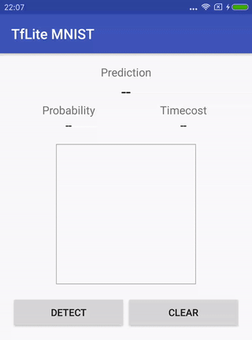

# MNIST with TensorFlow Lite on Android

[](https://colab.research.google.com/github/nex3z/tflite-mnist-android/blob/master/model.ipynb)

This project demonstrates how to use [TensorFlow Lite](https://www.tensorflow.org/lite) on Android for handwritten digits classification from MNIST.

<div align="center">
  
</div>

Prebuilt APK can be downloaded from [here](https://github.com/nex3z/tflite-mnist-android/releases/download/v1.0.0/tflite-mnist.apk).


## How to build from scratch

### Environment

- Python 3.6, TensorFlow 1.13.1
- Linux or macOS for tflite model conversion.


### Step 1. Train and convert the model to TensorFlow Lite FlatBuffer

Run all the code cells in [model.ipynb](https://github.com/nex3z/tflite-mnist-android/blob/master/model.ipynb). 

- If you are running Jupyter Notebook locally, a `mnist.tflite` file will be saved to the project directory.
- If you are running the notebook in [Google Colab](https://colab.research.google.com/), a `mnist.tflite` file will be downloaded.

### Step 2. Build Android app

Copy the `mnist.tflite` generated in Step 1 to `/android/app/src/main/assets`, then build and run the app. A prebuilt APK can be downloaded from [here](https://github.com/nex3z/tflite-mnist-android/releases/download/v1.0.0/tflite-mnist.apk).

The [Classifer](https://github.com/nex3z/tflite-mnist-android/blob/master/android/app/src/main/java/com/nex3z/tflitemnist/Classifier.java) reads the `mnist.tflite` from `assets` directory and loads it into an [Interpreter](https://github.com/tensorflow/tensorflow/blob/master/tensorflow/lite/java/src/main/java/org/tensorflow/lite/Interpreter.java) for inference. The Interpreter provides an interface between TensorFlow Lite model and Java code, which is included in the following library.

```
implementation 'org.tensorflow:tensorflow-lite:1.13.1'
```

If you are building your own app, remember to add the following code to [build.gradle](https://github.com/nex3z/tflite-mnist-android/blob/master/android/app/build.gradle#L19) to prevent compression for model files.

```
aaptOptions {
    noCompress "tflite"
    noCompress "lite"
}
```

## Credits

- The basic model architecture comes from [tensorflow-mnist-tutorial](https://github.com/GoogleCloudPlatform/tensorflow-without-a-phd/tree/master/tensorflow-mnist-tutorial).
- The official TensorFlow Lite [examples](https://github.com/tensorflow/examples/tree/master/lite/examples).
- The [FingerPaint](https://android.googlesource.com/platform/development/+/master/samples/ApiDemos/src/com/example/android/apis/graphics/FingerPaint.java) from Android API demo.
